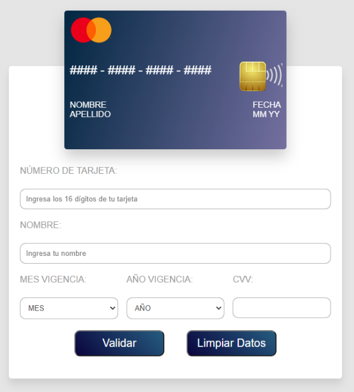

# CARD VALIDATION

## Índice

* [1. Resumen del proyecto](#1-resumen-del-protecto)
* [2. Investigación UX](#2-inventigación-UX)
* [3. Contruido con](#3-construido-con)
* [4. Autores](#4-autores)
* [5. Licencia](#5-licencia)

***

## 1. Resumen del proyecto

En este READ.ME encontrarás la información general aceca de la elaboración de una página web que servirá para mostrar si una tarjeta de crédito o débito es valida para proceder con la compra de productos en una tienda online (s-Shop).

***

## 2. Investigación UX

### 2.1 Definición del producto

El proyecto fue elaborado con la finalidad de apoyar a una tienda online (S-Shop) para validar las tarjetas de sus compradores por medio del algoritmo de Luhn y posteriormente finalizar con la compra de los productos.

### 2.2 Solución a los usuarios

- **Tienda online (S-shop)**. Este proyecto ayuda a la tienda online para validar de manera correcta las tarjetas de los compradores y posterioremente proceder con el cobro de los productos.

- **Compradores de tienda online (S-shop)**. Ayuda a los compradores a verificar que estén agregando correctamente los datos de su tarjeta de crédito o débito para concluir con la compra de los productos.

### 2.3 Elaboración de prototipo

### 2.4 Feedback

Al presentar el proyecto con los usuarios nos porporcionaron las siguientes recomendaciones:

- En el archivo index.html, se recomienda agregar en las etiquetas "a href=" el signo "#" con la finalidad de que las opciones adicionales nos manden a otra página aún no existente.

- Se recomienda agregar más comentarios en el código con la finalidad de identificar con mayor facilidad a que parte de la página corresponde el código.

### 2.5 Prototipo Final

***

## 3. Construido con 🛠️

Las herramientas que utilizamos para la elaboración de este proyecto son las siguientes:

* [HTML] - Lenguaje de Marcado de Hipertexto
* [CSS] - Hojas de Estilo en Cascada
* [JAVASCRIPT] -  lenguaje de programación interpretado
* [FIGMA] - Elaboración del prototipo  (https://www.figma.com/file/zCynwRxsF0n2A3jRsh6QeA/S-Shop---Valiadation-Card?node-id=0%3A1)
* [TRELLO] - Planeación de actividades (https://trello.com/invite/b/6Yq8fWxt/87404d58afaf3fa0670e7a4ff6449fec/cardvalidation)
* [REPLIT] - (https://replit.com/) - Para entrega final del proyecto

***

## 4. Autores ✒️

Las personas que contribuyeron en la elaboración de este proyecto son las siguientes:

* **Lorena Rojas** - *Proyecto completo*

***

## 5. Licencia 📄

Este proyecto está bajo la Licencia by Lorena Rojas (Card_Validation).

---
⌨️ con ❤️ por [Lorena Rojas] 😊